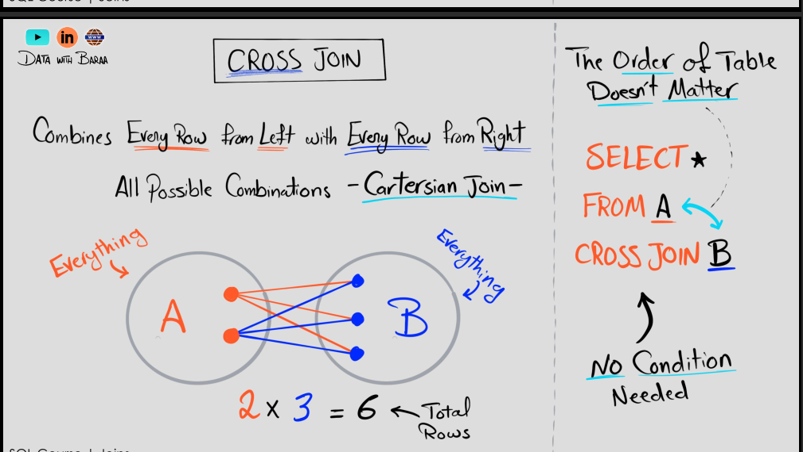

## JOINS 


```sql
SELECT  * 
FROM tableA -- left table 
JOIN tableB -- default to INNER JOIN -- See the images for info -- righttable
ON tableA.id = tableB.id --condition to join on 
-- so it will return rows where the id matches in both tables
-- with all the columns from both tables

-- LEFT JOIN tableB -- left table and right table
-- RIGHT JOIN tableB -- right table and left table

SELECT  *
FROM tableA -- left table
FULL JOIN tableB  -- right table and left table all of them will be returned
ON tableA.id = tableB.id --condition to join on

```




```sql

SELECT *
FROM tableA -- left table
LEFT JOIN tableB -- right table
ON tableA.id = tableB.id --condition to join on
-- this will return all rows from tableA that do not have a match in tableB
WHERE tableB.id IS NULL -- this will filter out the rows 
--that have a match in tableB
-- for example i have two tables the customer details and the orders details
-- i need the customers who didnot place any orders so in that case 
-- i will use LEFT ANTI JOIN where the left the the customer and the 
-- right is the orders
```


