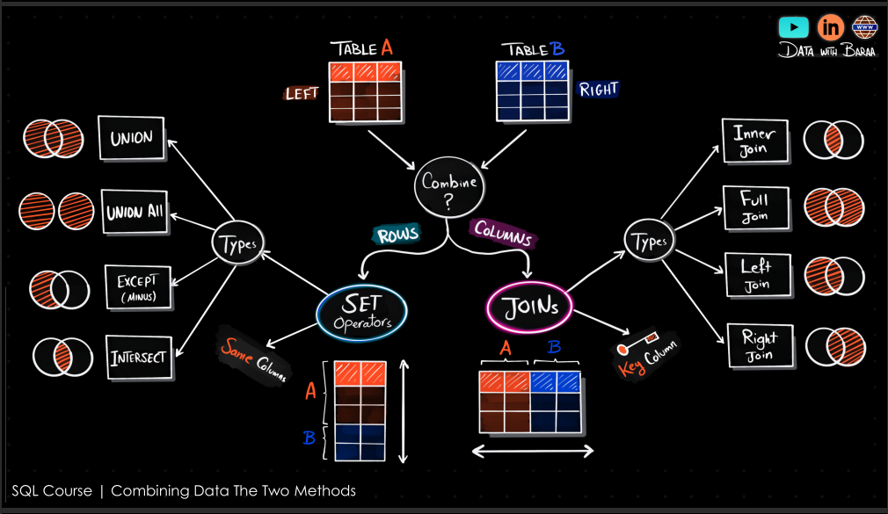
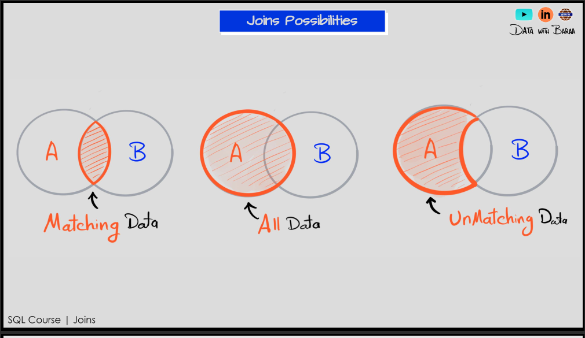
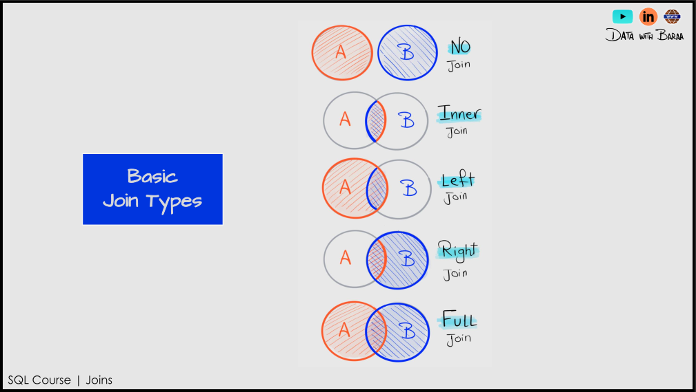
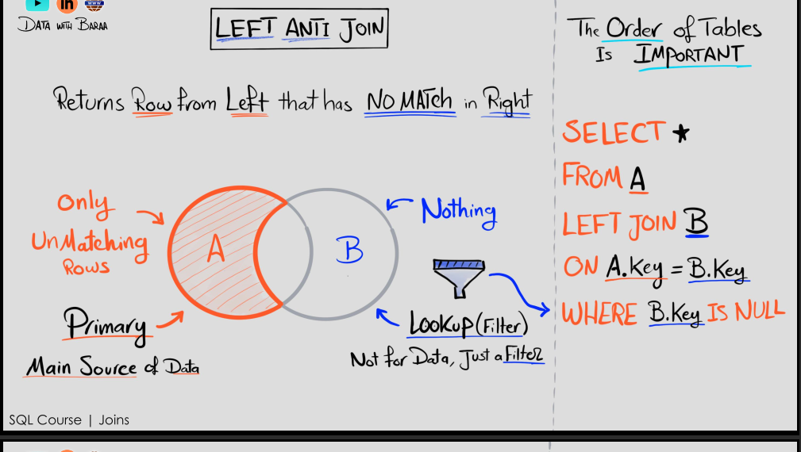
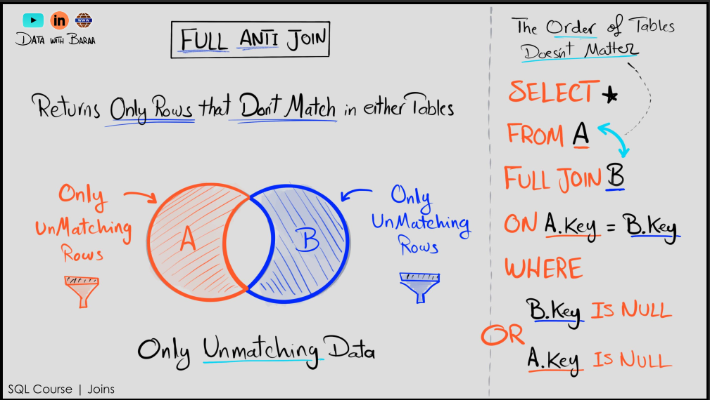
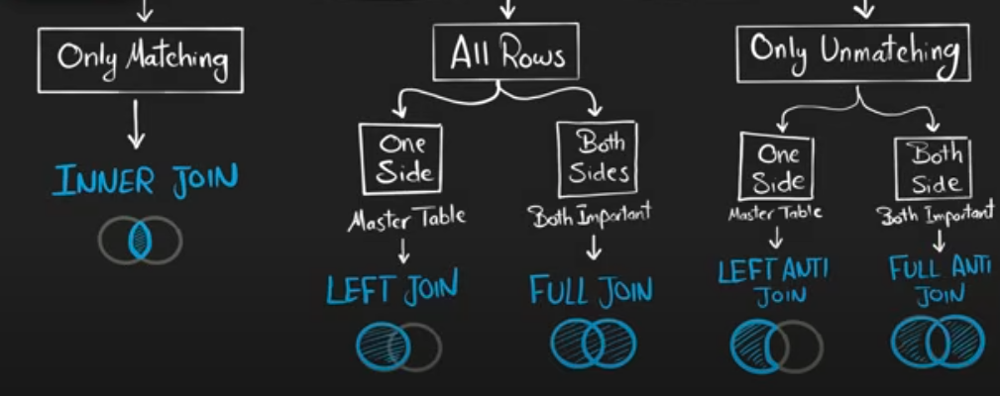

## JOINS 






```sql
SELECT  * 
FROM tableA -- left table 
JOIN tableB -- default to INNER JOIN -- See the images for info -- righttable
ON tableA.id = tableB.id --condition to join on 
-- so it will return rows where the id matches in both tables
-- with all the columns from both tables

-- LEFT JOIN tableB -- left table and right table
-- RIGHT JOIN tableB -- right table and left table

SELECT  *
FROM tableA -- left table
FULL JOIN tableB  -- right table and left table all of them will be returned
ON tableA.id = tableB.id --condition to join on

```







```sql

SELECT *
FROM tableA -- left table
LEFT JOIN tableB -- right table
ON tableA.id = tableB.id --condition to join on
-- this will return all rows from tableA that do not have a match in tableB
WHERE tableB.id IS NULL -- this will filter out the rows 
--that have a match in tableB
-- for example i have two tables the customer details and the orders details
-- i need the customers who didnot place any orders so in that case 
-- i will use LEFT ANTI JOIN where the left the the customer and the 
-- right is the orders
```



# 📚 Users and Books: Many-to-Many Relationship Example

This example demonstrates how to model and query a **many-to-many** relationship using SQL.

---

## 📌 Scenario

- Each **user** can order **many books**.
- Each **book** can be ordered by **many users**.
- The relationship is represented using an **`orders`** table as a join table.

---

## 🗂️ Database Schema

### 🔹 users

| Column   | Type    | Description           |
|----------|---------|-----------------------|
| user_id  | INT     | Primary Key           |
| name     | TEXT    | Name of the user      |
| email    | TEXT    | User's email address  |

---

### 🔹 books

| Column   | Type    | Description        |
|----------|---------|--------------------|
| book_id  | INT     | Primary Key        |
| title    | TEXT    | Title of the book  |
| author   | TEXT    | Author name        |

---

### 🔹 orders (Join Table)

| Column     | Type    | Description                    |
|------------|---------|--------------------------------|
| order_id   | INT     | Primary Key                    |
| user_id    | INT     | Foreign Key → `users.user_id` |
| book_id    | INT     | Foreign Key → `books.book_id` |
| order_date | DATE    | When the order was placed      |

---

## 🧾 Query: Show All Users with Their Ordered Books

```sql
SELECT 
  u.user_id,
  u.name AS user_name,
  b.book_id,
  b.title AS book_title,
  o.order_date
FROM orders AS o
JOIN users AS u ON o.user_id = u.user_id
JOIN books AS b ON o.book_id = b.book_id;

