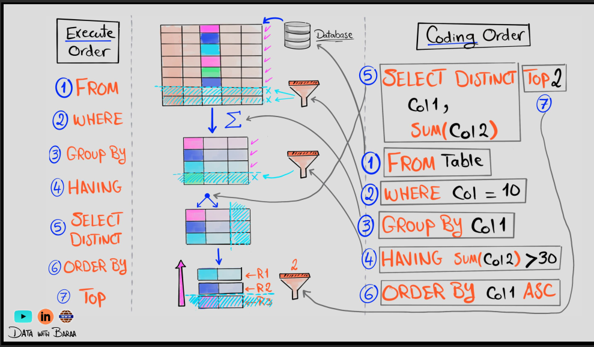

## SELECT

```sql
SELECT 
  country,
  COUNT(*) AS user_count,
  AVG(revenue) AS avg_revenue
FROM filtered_data
JOIN purchases ON filtered_data.user_id = purchases.user_id
GROUP BY country
HAVING AVG(revenue) > 50
ORDER BY user_count DESC
LIMIT 5 OFFSET 0;
```

```sql
/* SELECT is like print where it copy rows from tables and give them to you back*/
SELECT * 
FROM table_name; /*select all columns from the table */

SELECT customer_id, 
    first_name, 
    last_name 
FROM customers; /*select specific columns from the table */
/*
WHERE is used to filter the rows based on a condition.
*/

/*select all customers with last name Smith and first name 
starting with John or first name is Jane, foo, or bar */
SELECT * 
FROM customers 
WHERE last_name = 'Smith'
AND first_name LIKE 'John%'
OR first_name IN ('jane' , 'foo' , 'bar'); 

-- you can use BETWEEN to specify a range of values
SELECT *
FROM customers 
WHERE age BETWEEN 18 AND 30; 

-- you can use LIMIT to limit the number of rows returned
SELECT *
FROM customers
LIMIT 10; /*select the first 10 rows from the table */

-- you can use HAVING to filter the results of a GROUP BY clause
SELECT last_name, COUNT(*) AS count
FROM customers
GROUP BY last_name
HAVING COUNT(*) > 1; /*select last names that appear more than once */

-- you can use ORDER BY to sort the results
SELECT *
FROM customers
ORDER BY last_name ASC, first_name DESC; 

/*sort by last name ascending and first name descending */
-- you can use GROUP BY to group the results by a column
SELECT last_name, COUNT(*) AS count
FROM customers
GROUP BY last_name;

```




