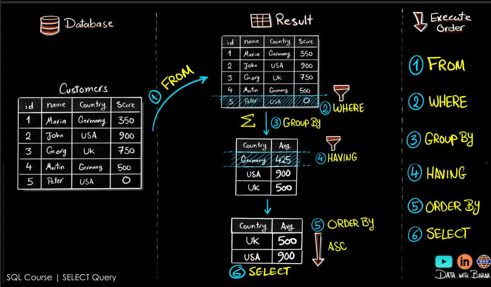
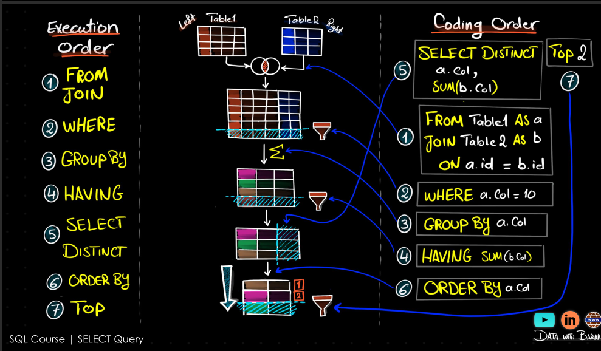

## SELECT


### the very short summary of SELECT
```sql
SELECT  -- select columns 
  country,
  COUNT(*) AS user_count,
  AVG(revenue) AS avg_revenue
FROM filtered_data -- from the filtered_data table
JOIN purchases ON filtered_data.user_id = purchases.user_id -- join with the purchases table on user_id
WHERE country IS NOT NULL -- where country is not null (filter before grouping)
GROUP BY country -- squach the results by country
HAVING AVG(revenue) > 50 -- filter after grouping 
ORDER BY user_count DESC -- order the results by user_count in descending order
LIMIT 5 OFFSET 0; -- limit the results to 5 rows starting from the first row
```

```sql
/* SELECT is like print where it copy rows from tables and give them to you back*/
SELECT * 
FROM table_name; /*select all columns from the table */

SELECT customer_id, 
    first_name, 
    last_name 
FROM customers; /*select specific columns from the table */
/*
WHERE is used to filter the rows based on a condition.
*/

/*select all customers with last name Smith and first name 
starting with John or first name is Jane, foo, or bar */
SELECT * 
FROM customers 
WHERE last_name = 'Smith'
AND first_name LIKE 'John%' -- whe have % (anything) and _ (one character) wildcards
OR first_name IN ('jane' , 'foo' , 'bar'); 

-- you can use BETWEEN to specify a range of values
SELECT *
FROM customers 
WHERE age BETWEEN 18 AND 30;  -- the range is inclusive, so it includes 18 and 30

-- you can use LIMIT to limit the number of rows returned
SELECT *
FROM customers
LIMIT 10; /*select the first 10 rows from the table */

-- you can use HAVING to filter the results of a GROUP BY clause
SELECT last_name, COUNT(*) AS count
FROM customers
GROUP BY last_name
HAVING COUNT(*) > 1; /*select last names that appear more than once */

-- you can use ORDER BY to sort the results
SELECT *
FROM customers
ORDER BY last_name ASC, first_name DESC; 

/*sort by last name ascending and first name descending */
-- you can use GROUP BY to group the results by a column
SELECT last_name, COUNT(*) AS count
FROM customers
GROUP BY last_name;

```






[go to docs/02_Query_Data_SELECT for more images like this](./docs/02_Query_Data_SELECT.pdf)


