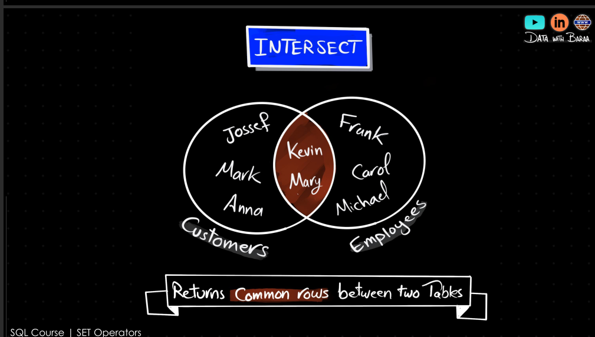
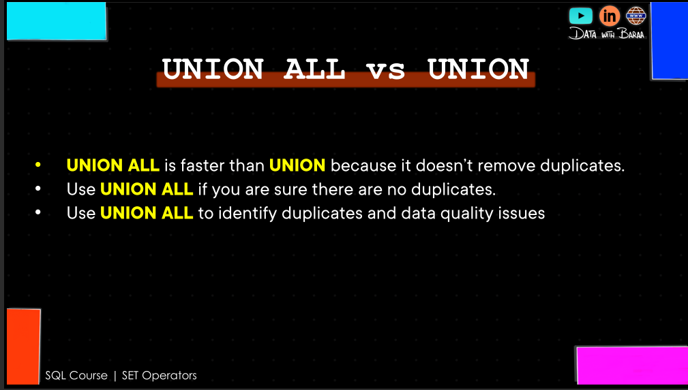
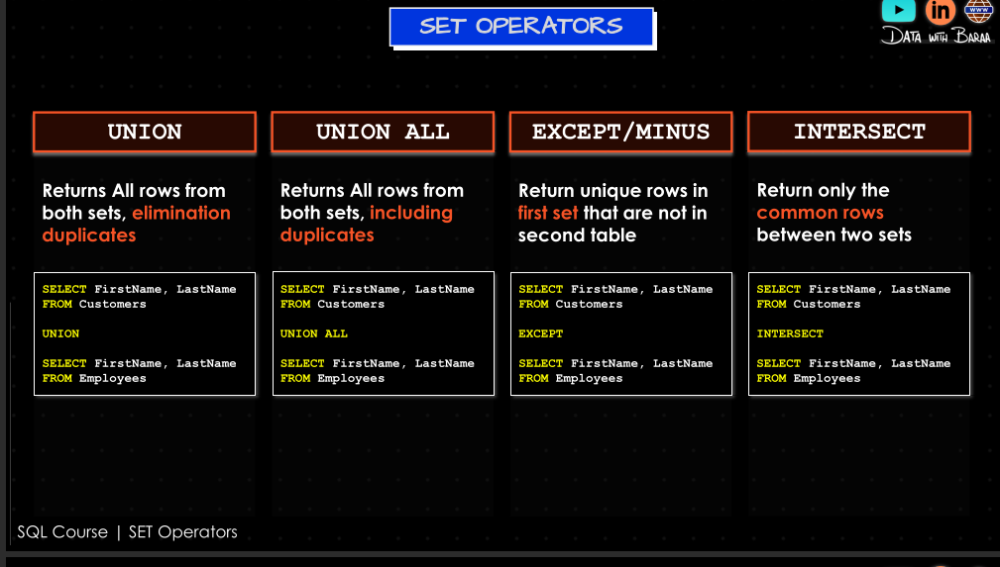

## SETS

### There are several ways to combine rows in SQL:
> UNION 
> UNION ALL
> EXCEPT
> INTERSECT

```sql
SELECT column1, column2 FROM table1
UNION
SELECT column1, column2 FROM table2;
-- the columns must be the same in both queries 
--and the data types must be compatible
-- if this is the case the result will be a 
--set of unique rows from both queries
-- the column aliases of the first query will be used in the result set

SELECT column1, column2 FROM table1
UNION ALL
SELECT column1, column2 FROM table2;
-- this will return all rows from both queries,
-- including duplicates

SELECT column1, column2 FROM table1
EXCEPT
SELECT column1, column2 FROM table2;
-- this will return all rows from the first query
-- that are not in the second query

```






