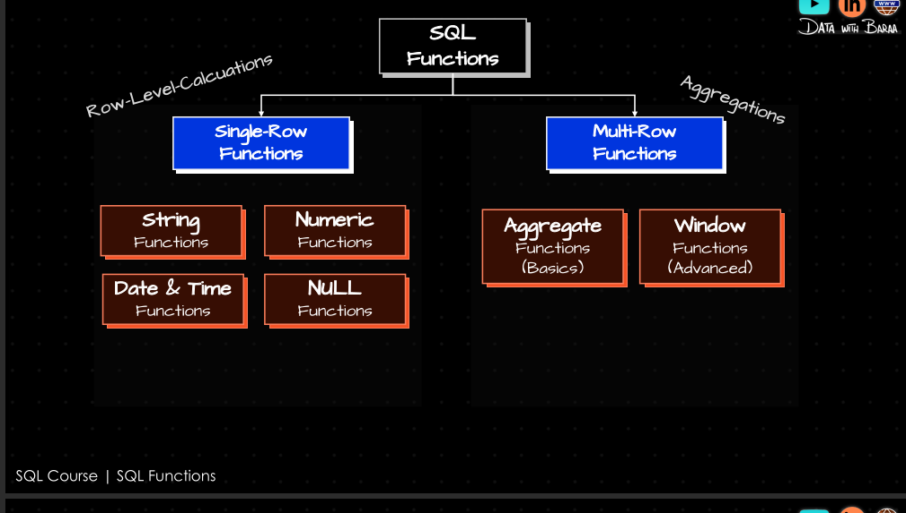
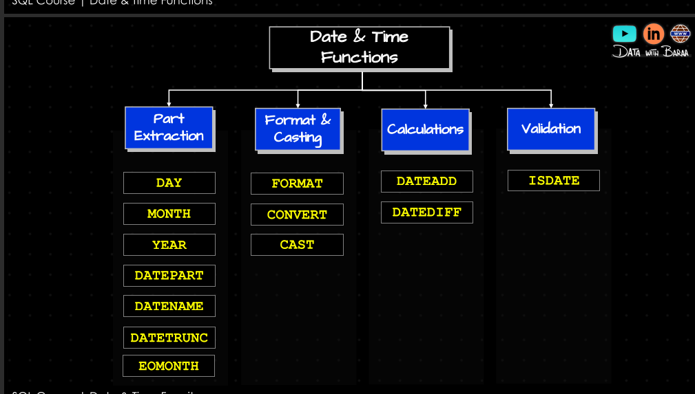
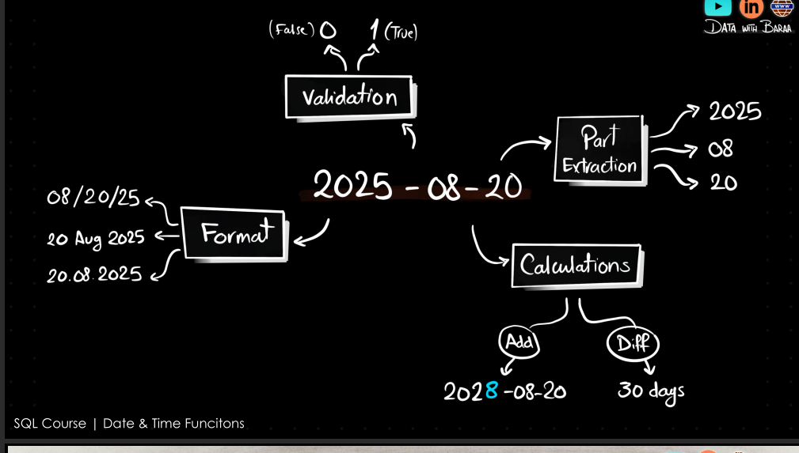
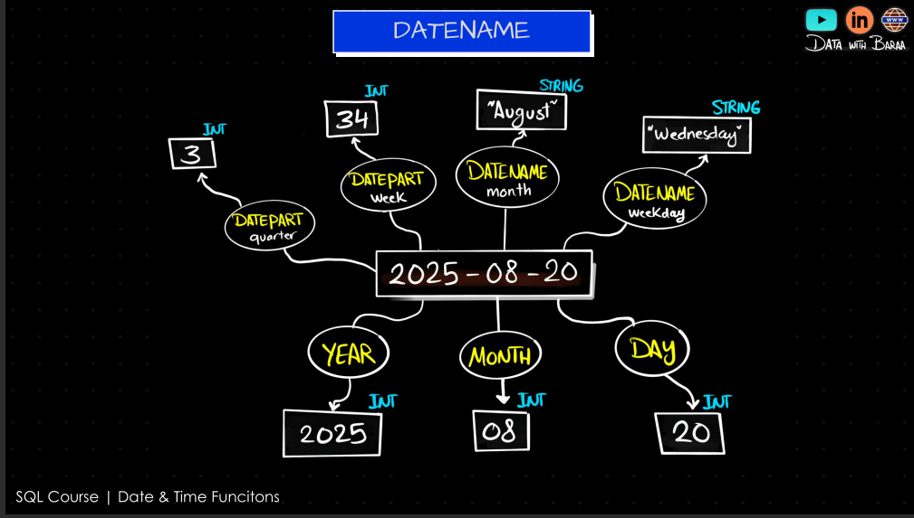
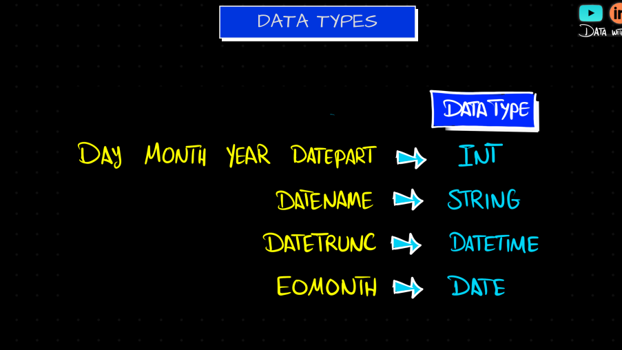
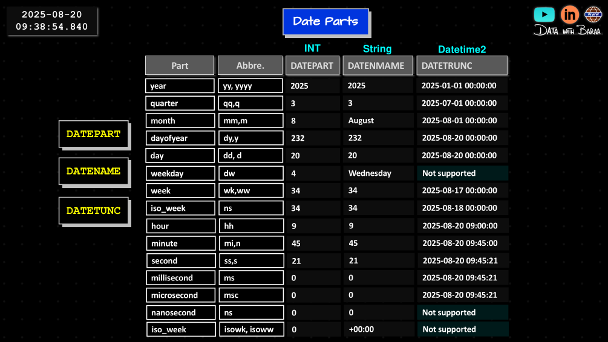

## BUILD IN ROW LEVEL FUNCTIONS



### ROW LEVEL FUNCTIONS
#### STRINGS

```sql

SELECT CONCAT(first_name,' ', last_name) AS full_name;
-- this will return all columns from the actor table and add a new column full_name which is a concatenation of first_name and last_name
SELECT * , UPPER(CONCAT(first_name,' ', last_name)) AS full_name;
-- the same as the output above but the full_name will be in uppercase
SELECT * 
FROM actor
WHERE TRIM(first_name) != first_name
OR TRIM(last_name) != last_name;
-- find all actors where the first_name or last_name has leading or trailing spaces

SELECT LENGTH(first_name) ;-- returns the length of the first_name

SELECT 'report.pdf' AS old_report
, REPLACE('report.pdf', '.pdf', '_2023.pdf') AS new_report;
-- this will return the old_report and a new_report with the .pdf replaced by _2023.pdf

SELECT LEFT('report.pdf', 6) AS left_part ;-- returns the first 6 characters of the string
, RIGHT('report.pdf', 4) AS right_part; ;-- returns the last 4 characters of the string

SELECT SUBSTRING(first_name, 1, 3) AS first_three_characters;
-- returns the first 3 characters of the first_name
```


#### NUMBERS
```sql
SELECT  ROUND(8.5) AS rounded_value ;-- output:9

SELECT  ROUND(8.56362 , 3) AS rounded_value ;-- output:8.564

SELECT CEIL(8.1) AS ceil_value ;-- output:9

SELECT FLOOR(8.9) AS floor_value ;-- output:8

SELECT  ABS(-8.9) AS absolute_value ;-- output:8.9

SELECT  POWER(2, 3) AS power_value ;-- output:8 (2 raised to the power of 3)

SELECT  SQRT(16) AS square_root_value ;-- output:4 (square root of 16)

SELECT  MOD(10, 3) AS modulus_value ;-- output:1 (remainder of 10 divided by 3)

SELECT  PI() AS pi_value ;-- output:3.141592653589793

SELECT  RANDOM() AS random_value ;-- output: a random number between 0 and 1

SELECT  TRUNC(8.9) AS truncated_value ;-- output:8 (removes the decimal part)

SELECT  TRUNC(8.9, 1) AS truncated_value ;-- output:8.9 (removes the decimal part but keeps one decimal place)

SELECT  GREATEST(8, 9, 10, 7) AS greatest_value ;-- output:10 (returns the largest value)

SELECT  LEAST(8, 9, 10, 7) AS least_value ;-- output:7 (returns the smallest value)

SELECT  SIGN(-8.9) AS sign_value ;-- output:-1 (returns -1 for negative numbers, 1 for positive numbers, and 0 for zero)

SELECT CAST(CAST('8.9' AS FLOAT) AS INTEGER) AS casted_value;
-- or
SELECT CAST('8.9'::FLOAT AS INTEGER) AS casted_value;

```

#### DATES
```sql
SELECT CURRENT_DATE AS current_date; -- returns the current date

SELECT CURRENT_TIME AS current_time; -- returns the current time

SELECT CURRENT_TIMESTAMP AS current_timestamp; -- returns the current date and time

SELECT NOW() AS current_datetime; -- returns the current date and time

SELECT DATE '2023-10-01' AS specific_date; -- returns a specific date

SELECT EXTRACT(YEAR FROM CURRENT_DATE) AS current_year; -- returns the current year
-- as an Integer

SELECT DATE_PART('month', CURRENT_DATE) AS current_month_part; -- returns the current month using date_part -- as an Integer

SELECT DATE_TRUNC('year', CURRENT_DATE) AS start_of_year; -- returns the start of the current year-- as a date

SELECT DATE '2023-10-01' + INTERVAL '1 day' AS next_day; -- adds 1 day to a specific date


SELECT DATE_TRUNC('MONTH', CURRENT_DATE) + INTERVAL '1 MONTH' - INTERVAL '1 day' AS end_of_month; -- to get the end of the current month
```











### 🗓️ PostgreSQL Date Formatting with `TO_CHAR()`


#### CASTING

```sql
TO_CHAR(date_value, 'format_pattern')
```

| Pattern   | Example Output   | Description                                  |
|-----------|------------------|----------------------------------------------|
| `YYYY`    | `2025`           | 4-digit year                                 |
| `YY`      | `25`             | Last 2 digits of year                        |
| `MONTH`   | `JULY     `      | Full month name (uppercase, padded)          |
| `Month`   | `July     `      | Full month name (capitalized, padded)        |
| `month`   | `july     `      | Full month name (lowercase, padded)          |
| `MON`     | `JUL`            | Abbreviated month name (uppercase)           |
| `Mon`     | `Jul`            | Abbreviated month name (capitalized)         |
| `mon`     | `jul`            | Abbreviated month name (lowercase)           |
| `MM`      | `07`             | 2-digit month number                         |
| `DAY`     | `WEDNESDAY`      | Full weekday name (uppercase, padded)        |
| `Day`     | `Wednesday`      | Full weekday name (capitalized, padded)      |
| `day`     | `wednesday`      | Full weekday name (lowercase, padded)        |
| `DY`      | `WED`            | Abbreviated weekday name (uppercase)         |
| `Dy`      | `Wed`            | Abbreviated weekday name (capitalized)       |
| `dy`      | `wed`            | Abbreviated weekday name (lowercase)         |
| `DDD`     | `204`            | Day of year (001–366)                        |
| `DD`      | `23`             | Day of month (01–31)                         |
| `D`       | `4`              | Day of week (1=Sunday, 7=Saturday)           |
| `W`       | `4`              | Week of month (1–5)                          |
| `WW`      | `30`             | Week number of year (1–53)                   |
| `HH`      | `07`             | Hour (1–12)                                  |
| `HH12`    | `07`             | Hour (1–12), same as `HH`                    |
| `HH24`    | `19`             | Hour (0–23)                                  |
| `MI`      | `45`             | Minute (0–59)                                |
| `SS`      | `30`             | Second (0–59)                                |
| `MS`      | `123`            | Milliseconds (depending on precision)        |
| `AM` / `PM` | `AM` / `PM`    | Meridian indicator                           |
| `am` / `pm` | `am` / `pm`    | Meridian indicator (lowercase)               |
| `A.M.` / `P.M.` | `A.M.`     | Meridian indicator with dots                 |
| `TZ`      | `UTC`            | Time zone abbreviation                       |

#### Standard Date For all inputs
```sql

SELECT TO_CHAR(current_date, 'DD Month YYYY');
-- Output: 23 July 2025

SELECT TO_CHAR(NOW(), 'YYYY-MM-DD HH24:MI:SS');
-- Output: 2025-07-23 19:45:30

-- if you want 12 based hour system you can use 
SELECT TO_CHAR(NOW(), 'YYYY-MM-DD HH12:MI:SS AM');

SELECT TO_DATE('23-07-2025', 'DD-MM-YYYY');  -- ✅ returns: 2025-07-23

SELECT TO_TIMESTAMP('23-07-2025 19:45:30', 'DD-MM-YYYY HH24:MI:SS');  -- ✅ returns: 2025-07-23 19:45:30

SELECT CAST('123' AS INTEGER);  -- returns 123

SELECT CAST('123.45' AS FLOAT);  -- returns 123.45

SELECT CAST('2023-10-01' AS DATE);  -- returns 2023-10-01

SELECT CAST('2023-10-01 12:34:56' AS TIMESTAMP);  -- returns 2023-10-01 12:34:56

```

#### FORMAT

```sql
SELECT FORMAT('Hello, %s!', 'Garma'); -- will return 'Hello, Garma!'

SELECT FORMAT('The value of pi is approximately %.2f', PI()); -- will return 'The value of pi is approximately 3.14'

SELECT FORMAT('Today is %s', CURRENT_DATE); -- will return 'Today is 2023-10-01' (or the current date)
SELECT FORMAT(time_table , 'dd') ;-- will return the day part of the time_table in 'dd' format

```

#### Add & SUB Date

```sql
SELECT CURRENT_DATE + INTERVAL '5 days';

SELECT CURRENT_TIMESTAMP + INTERVAL '3 hours';

SELECT CURRENT_TIMESTAMP + INTERVAL '2 days 4 hours';

SELECT CURRENT_TIMESTAMP - INTERVAL '45 minutes';

-- INTERVAL SYNTAX
INTERVAL '1 year 2 months 3 days 4 hours 5 minutes 6 seconds'

SELECT DATE '2025-08-10' - DATE '2025-08-01';  -- Result: 9

SELECT TO_CHAR(DATE '2024-08-01' - DATE '2025-08-01' + DATE '2000-01-01', 'YYYY-MM-DD');
-- Result: 1999-01-01

```


